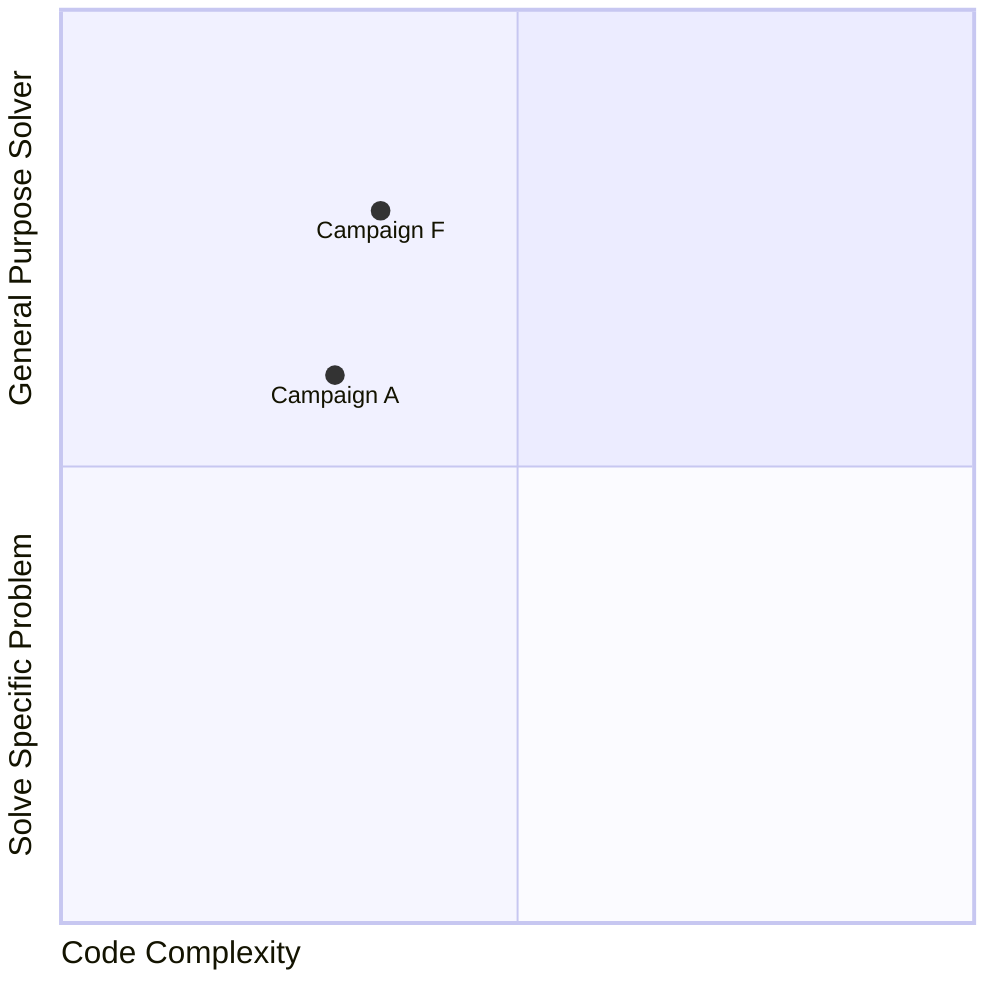

> “What I cannot create, I do not understand.”
> 
> --- Richard P. Feynman

## Cellular Modeling Mindset
By using `cellular_raza` you, the researcher will be strongly encouraged to follow
mechanistically-driven thought processes from the perspective of individual biological cells.
Global behaviour such as number of branches or speed of growth of a tissue can often be mathematically described with simplistic models.
While these models may obtain precise numerical values, they often only teach us very little about the underlying cellular processes.
In addition, the description of the model was done top-to-bottom where one works back from observed bahaviour to intrinsic processes.
Agent-based models are designed to be used bottom-up, meaning cellular processes come first and will govern global behaviour from their intrinsic rules and mechanics.

## Local Rules
Cells function exclusively on a local level when inspecting individual cellular agents.
There are now governing rules that specify global behaviour.
Instead, any global behaviour one sees is a result of a self-organizing system that exhibits these properties.
The overall global effects can be deduced by formulating local rules on the cellular level that transform to the desired results when applying coarse-graining methodologies.

## Etymology
The name `cellular_raza` is an artistic combination of "cell" and ["tabula rasa"](https://en.wikipedia.org/wiki/Tabula_rasa).
While the original intent was to describe the simulation tool as written from a "blank slate", many of the interpretations from the wikipedia article are interesting and fitting. The logo has the [Rust](https://www.rust-lang.org/) symbol embedded, but when referring to the package in text, the snake case version `cellular_raza` in a monospaced font should be used.

<!-- TODO check these points and possibly attach them to another subsection -->
## What this crate does not aim to offer
- A graphical user interface
    - Models should be created with native Rust Code (or in the future by interacting with Python or Julia)
    - Data Analysis can be done with Python/Julia
- The option to freely change everything however you like during runtime

<!-- TODO complete quadrant graph -->

## Only Local Rules
- Additions are commutative
    - This is inherently not true in almost all modern computers using floating point arithmetics
    It can lead to results which are not identical on a binary level, but should agree within their numerical uncertainty respective of the solver used.
- Multiplication with floats like f64 are commutative
- There should only be local rules
    - CellAgents are interacting with themselves, their neighbors and the extracellular properties around them.
      There is no exact definition of "local" but the first idea was to restrict interaction ranges.
- Any multithreading or implementaional details of how information is transported on an actual computer should be hidden from the end user.
    - Defining new cell-properties and domain/voxels should not involve thinking about parallelization etc.
