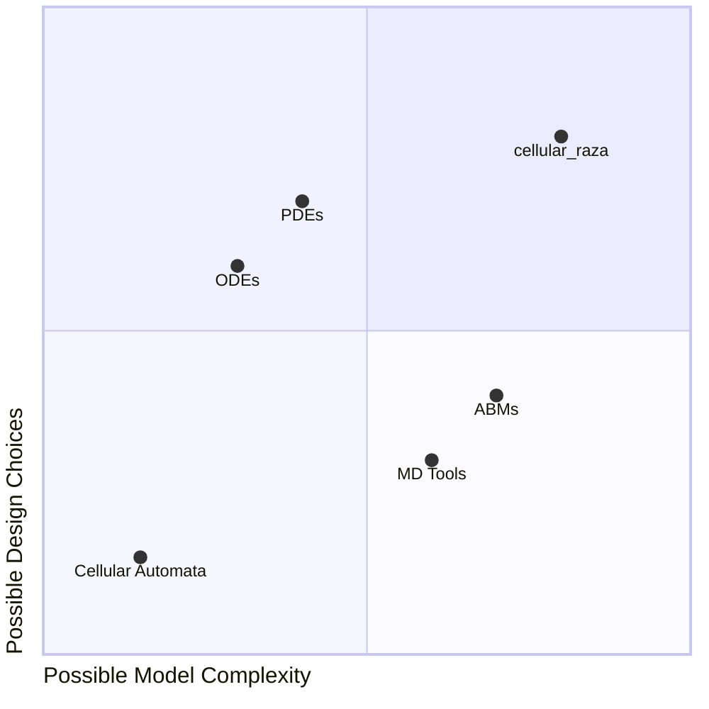

> “What I cannot create, I do not understand.”
> 
> --- Richard P. Feynman

## Cellular Modeling Mindset
By using `cellular_raza` you, the researcher will be strongly encouraged to follow
mechanistically-driven thought processes from the perspective of individual biological cells.
Global behaviour such as number of branches or speed of growth of a tissue can often be mathematically described with simplistic models.
While these models may obtain precise numerical values, they often only teach us very little about the underlying cellular processes.
In addition, the description of the model was done top-to-bottom where one works back from observed bahaviour to intrinsic processes.
Agent-based models are designed to be used bottom-up, meaning cellular processes come first and will govern global behaviour from their intrinsic rules and mechanics.

## Local Rules
Cells function exclusively on a local level when inspecting individual cellular agents.
There are now governing rules that specify global behaviour.
Instead, any global behaviour one sees is a result of a self-organizing system that exhibits these properties.
The overall global effects can be deduced by formulating local rules on the cellular level that transform to the desired results when applying coarse-graining methodologies.

## Etymology
The name `cellular_raza` is an artistic combination of "cell" and ["tabula rasa"](https://en.wikipedia.org/wiki/Tabula_rasa).
While the original intent was to describe the simulation tool as written from a "blank slate", many of the interpretations from the wikipedia article are interesting and fitting. The logo has the [Rust](https://www.rust-lang.org/) symbol embedded, but when referring to the package in text, the snake case version `cellular_raza` in a monospaced font should be used.

## What this crate aims to offer
`cellular_raza` offers a concise language in the form of [concepts](/internals/concepts)
that specify how cells behave.
Once the cellular behaviour is formulated in terms of these abstractions, we are able to
numerically solve the given system.
Furthermore, we offer features that simplify building a fully working simulation and customizing it.
In comparison with other tools, we provide more freedom in model design, thus enabling higher
levels of overall model complexity.

