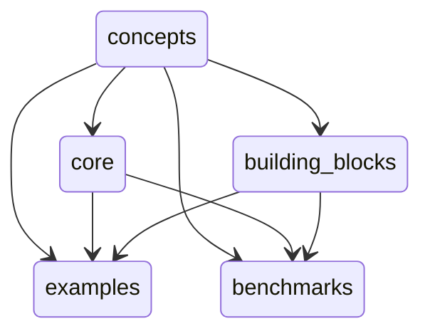

# Structure

`cellular_raza` consists of multiple crates working in tandem.
It was designed to have clear separations between conceptual choices and implementation details.
This approach allows us to have a greater amount of modularity and flexibility than regular
simulation tools.

These crates act on varying levels of abstraction to yield a fully working numerical simulation.
Since `cellular_raza` functions on different levels of abstraction, we try to indicate this in the
table below.

| crate | Abstraction Level | Purpose |
| --- | --- | --- |
| [`cellular_raza`](/docs/cellular_raza) | - | Bundle together functionality of all other crates. |
| [`concepts`](/docs/cellular_raza_concepts) | High | Collection of (mainly) traits which need to be implemented to yield a full simulation. |
| [`core`](/docs/cellular_raza_core) | Intermediate-High | Contains numerical solvers, storage handlers and more to actually solve a given system. |
| [`building_blocks`](/docs/cellular_raza_building_blocks) | Intermediate | Predefined components of cell-agents and domains which can be put together to obtain a full simulation. |
| [`examples`](https://github.com/jonaspleyer/cellular_raza/tree/master/cellular_raza-examples) | Application | [Showcases](/showcase) and introductions to different simulation approaches. |
| [`benchmarks`](/benchmarks) | Application | Performance testing of various configurations. |

# Development

<video src="cellular_raza-development-gource.mp4" controls style="width: minmax(100%, 1280px);">
