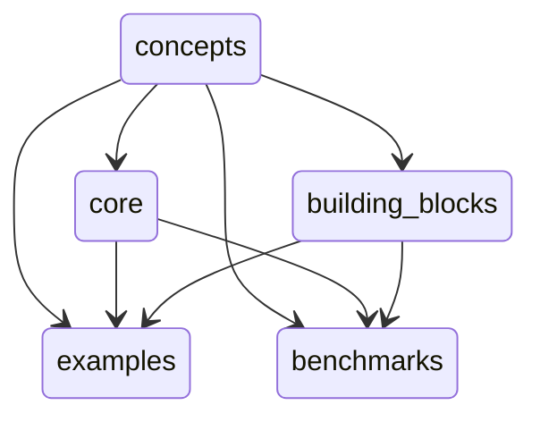

`cellular_raza` consists of multiple crates working in tandem.

```mermaid
stateDiagram-v2
    concepts --> core
    concepts --> building_blocks
    concepts --> examples
    concepts --> benchmarks
    core --> examples
    core --> benchmarks
    building_blocks --> examples
    building_blocks --> benchmarks
```
